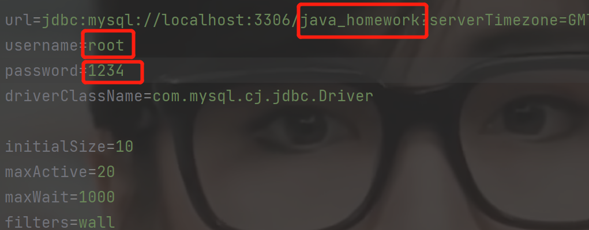

# :car:共享汽车管理系统

## :fire:来源

本项目为广东工业大学java课设，题目为汽车管理系统，设置汽车，用户，租车记录实现基本的增删改查功能

:heart:如果对你有用，欢迎点个:star:

## :pencil:技术栈

语言：java JDK1.8

数据库连接池：druid

界面编写：javafx

数据库：mysql

没有使用其他任何框架

## :running:如何运行

:first_quarter_moon_with_face: ​在mysql数据库中建立对应的表，数据可自己建表后插入

数据库建表语句如下：

```
#创建数据库
create DATABASE if not EXISTS java_homework

#使用诗句库
use java_homework

#创建表vehicle
create table if not EXISTS vehicle(
carNumber int,
brand VARCHAR(30),
userName VARCHAR(30) DEFAULT NULL,
idCard VARCHAR(30) DEFAULT NULL
)

#创建表user
CREATE table if not EXISTS user(
idCard VARCHAR(30),
userName VARCHAR(30),
carNumber int DEFAULT -1,
brand VARCHAR(30) DEFAULT NULL
)

#创建出租记录表history
CREATE table if not EXISTS history(
carNumber int,
brand VARCHAR(30),
userName VARCHAR(30),
idCard VARCHAR(30),
borrowTime VARCHAR(30),
returnTime VARCHAR(30),
)
```

:first_quarter_moon_with_face:将druid配置文件的数据库账号密码改成自己的，数据库名字如果跟上面的不一样也换成自己建的



:full_moon: 配置完后，打开controller包下的main.java文件，点击运行，即可跑起项目


## :rocket:运行结果


插入数据


其他功能用户可一一测试，因为项目功能比较单一，其他情况就不一一说明